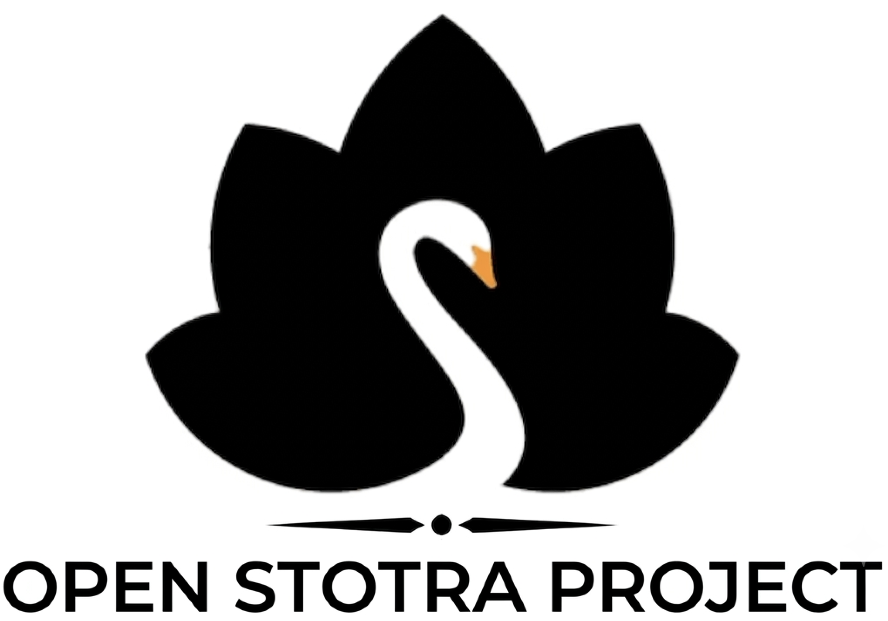

An open-source, highly structured YAML dataset of multi-lingual Hindu devotional texts, curated for typography-focused e-readers under a strict non-commercial license.

## ⚖️ License & Commercial Restrictions

This project is licensed under the **Creative Commons Attribution-NonCommercial 4.0 International (CC BY-NC 4.0)** license.

### 🚫 Commercial App Clones Prohibited
You are strictly prohibited from cloning, scraping, or utilizing this dataset, database structure, or its YAML files to power, train, or distribute any commercial, ad-supported, or monetized mobile applications, websites, or software services. This dataset is explicitly reserved for the open-source community and the private ecosystem of the **Manas** application.
